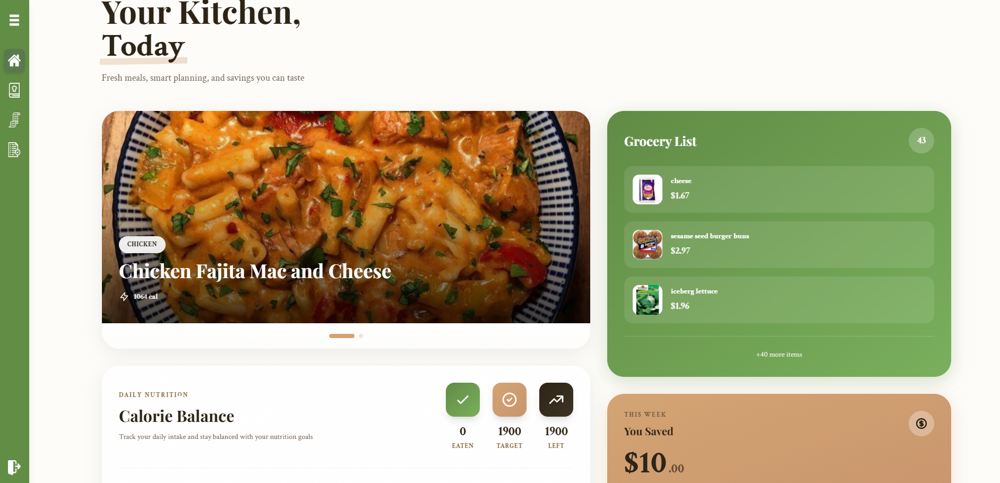
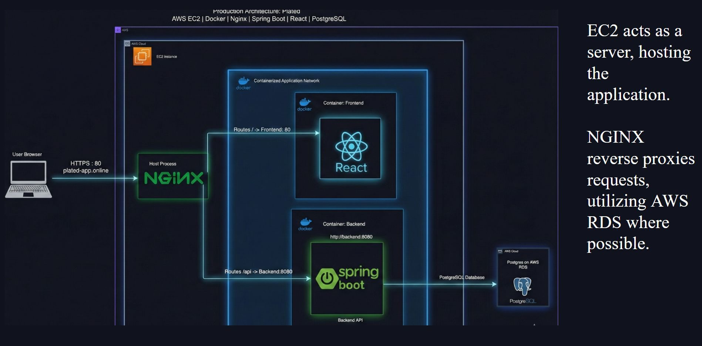

#  Plated

A full-stack application aimed to help you save food, tighten your budget, and plan interesting, tasteful meals from around the world! 


---

## Live Demo

**Try it now:** [Full App](https://plated-app.online/landing)

*Frontend preview:* [Frontend](https://pantry-assist.vercel.app/landing)

---

## Demo Photos
<table>
  <tr>
    <th>Menu</th>
    <th>Cooking Steps</th>
  </tr>
  <tr>
    <td align="center">
      
    </td>
    <td align="center">
      
    </td>
  </tr>
</table>

---

##  Objective

This project, 'plated' aims to serve those who are on a budget or want help tracking what they eat — from calories to trying new foods — all in a way that's easy to manage through the app, so you can spend more time doing what's important to you!

---

## Why use it?

Plated offers a simple solution to everyday issues, meal planning and buying groceries. Instead of spending more time figuring out what to get, just get a meal plan on us, and only buy the groceries and cook the delicious meals!

---

## ⚙️ Features

###  Grocery Tracking / Planning
This application, based on your requirements and use cases, adapts to help you find interesting meals while providing grocery prices in your local area via Walmart's data.

###  Meal Planning
Need help tracking how many calories you eat or what exactly you're eating? Say no more! Plated easily tracks your weekly meals in a clean, organized format, to make sure you never overeat.

###  Security
Plated boasts secure, role-based access control throughout the app, enforcing security through JWT tokens.

### Analytics
Know how much you save compared to the average Canadian, at any time

### Ease of use
We offer an easy UI to navigate through to help you day-by-day to cook, and plan your meals!



---

##  Architecture

Plated uses a containerized architecture deployed on AWS, ensuring scalability and reliability.



### How it works

- **NGINX** acts as a reverse proxy, routing incoming HTTPS requests from `plated-app.online` to the appropriate containers
- **Frontend Container (React)** serves the user interface on port 80
- **Backend Container (Spring Boot)** handles API requests on port 8080, processing business logic and authentication
- **PostgreSQL Database** runs on AWS RDS, providing reliable data persistence separate from the application containers
- **Docker** containerizes both frontend and backend, making deployment consistent across environments
- **EC2** hosts the entire application stack, with all containers running within a single instance for cost-effective production deployment

This architecture allows for easy local development with Docker Compose while maintaining production-grade deployment on AWS infrastructure.

---

## Getting Started

Currently, plated is hosted full-stack on EC2. If you'd like to run it yourself you'll need:
- AWS RDS, EC2 instances
- Pg Admin
- API keys (Walmart with public/private keys, MealDB, Nutritionix which is now deprecated)

---

### 🐳 Quick Start with Docker (Recommended)

The fastest way to get Plated running locally:

```bash
# Clone the repository
git clone https://github.com/bmar1/Plated.git
cd Plated

# Create your environment file
cp .env.example .env
# Edit .env with your API keys and configuration

# Build and start all services
docker-compose up --build

# Access the application
# Frontend: http://localhost:3000
# Backend API: http://localhost:8080
```

That's it! Docker will handle setting up the database, backend, and frontend automatically.

#### Docker Commands

```bash
# Start services in detached mode
docker-compose up -d

# View logs
docker-compose logs -f

# Stop services
docker-compose down

# Stop services and remove volumes (fresh start)
docker-compose down -v

# Rebuild after code changes
docker-compose up --build
```

---

### 💻 To run it locally (note that this will only run the frontend):
```bash
git clone https://github.com/bmar1/Plated.git
npm install
npm start
```

---

## 📦 Project Structure

```
Plated/
├── src/
│   ├── backend/          # Spring Boot application
│   │   ├── controllers/  # REST API endpoints
│   │   ├── models/       # Database entities
│   │   ├── services/     # Business logic
│   │   └── config/       # Security & app configuration
│   └── frontend/         # React application
│       ├── public/       # Static assets
│       └── src/          # React components
├── docker-compose.yml    # Docker services configuration
├── Dockerfile           # Container image definition
├── .env.example         # Environment template
└── README.md           # This file
```

---

## 🏗️ Tech Stack

### Backend
- **Spring Boot 3.5** - Robust Java framework for RESTful APIs
- **PostgreSQL** - Reliable relational database
- **AWS RDS** - Managed database hosting (production)
- **JWT Authentication** - Secure user sessions

### Frontend
- **React 18** - Modern UI framework
- **Responsive Design** - Mobile-first approach

### Infrastructure
- **Docker & Docker Compose** - Containerized development and deployment
- **AWS EC2** - Application hosting
- **GitHub Actions** - Continuous deployment
- **Vercel** - Frontend preview environment

---

## 🤝 Contributing

If you'd like to contribute, reach out to me on any social media and let's talk!

Otherwise, feel free to leave some issues or pull requests!

---

## 🙏 Acknowledgments

- TheMealDB for recipe data
- Walmart API for grocery pricing
- Nutritionix API for calories/macros
- The open-source community for inspiration and tools

---

**Built with ❤️ to make meal planning simple and budget-friendly**
